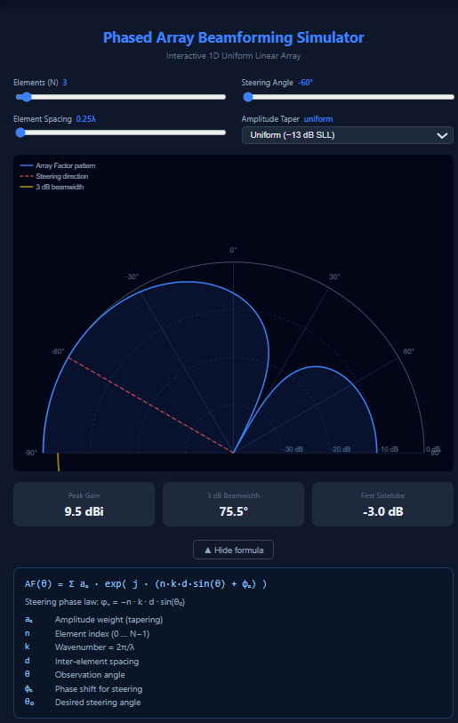

# Phased Array Beamforming Simulator

An interactive, browser-based simulator for visualizing how phased array antennas work — built as part of my Electronics and Communications Engineering portfolio.

**[▶ Live Demo](https://YOUR-USERNAME.github.io/beamforming-simulator)**



---

## What This Is

This tool lets you manipulate a virtual 1D antenna array in real time and watch the radiation pattern respond. You can steer the beam electronically, change the number of elements, adjust element spacing, and apply different amplitude tapers — all rendered live on a polar dB plot.

No install. No framework. One HTML file, open in any browser.

---

## Background & Motivation

I built this because phased arrays are one of those topics in ECE that look intimidating on paper but become immediately intuitive once you can see the math in action. The Array Factor equation is something you derive in your antenna theory course and then promptly forget what it actually *does*. Having a live visualizer changes that — you steer the angle slider and the beam swings, you increase N and it sharpens, you switch tapers and the sidelobes drop. The physics becomes obvious.

The technology is also genuinely everywhere right now. 5G mmWave base stations use massive phased arrays to serve multiple users simultaneously. AESA radar on modern fighter jets steers its beam electronically in microseconds with no moving parts. Starlink user terminals use flat phased arrays to track satellites across the sky. The same core equation — the Array Factor — underlies all of it.

---

## The Theory

### What a Phased Array Actually Does

A single antenna element radiates energy in all directions more or less equally (depending on the element type). To get a directional beam, you need multiple elements working together. The trick is timing: if you delay the signal to each element by exactly the right amount, the wavefronts all arrive in phase at your target angle and add up constructively. In every other direction they arrive out of phase and partially cancel.

The "delay" can be implemented as a true time delay or — more commonly in narrowband systems — as a phase shift. This is where the name comes from: a *phased* array.

### The Array Factor

For a Uniform Linear Array (ULA) of N elements spaced d apart, the combined far-field radiation pattern is described by the **Array Factor**:

```
AF(θ) = Σ(n=0 to N-1) [ aₙ · exp(j · (n·k·d·sin(θ) + φₙ)) ]
```

Breaking this down term by term:

| Symbol | Meaning |
|--------|---------|
| `θ` | Observation angle, measured from broadside (perpendicular to the array) |
| `n` | Element index, running from 0 to N−1 |
| `aₙ` | Amplitude weight applied to element n — this controls the taper |
| `k` | Wavenumber: k = 2π/λ, converts distance into phase |
| `d` | Physical spacing between adjacent elements |
| `φₙ` | Phase shift applied to element n — this is your steering control |
| `j` | Imaginary unit — the exp(j·x) = cos(x) + j·sin(x) is just a compact way to write a rotating phasor |

The magnitude |AF(θ)| gives you the amplitude of the radiated field in each direction. Squaring it gives radiated power. In practice we normalize to the peak and convert to decibels:

```
AF_dB(θ) = 20 · log₁₀( |AF(θ)| / max|AF(θ)| )
```

This is what the polar plot shows — 0 dB at the main beam peak, with sidelobes dropping below.

### Beam Steering

To point the main beam at a desired angle θ₀, you apply this phase shift to each element:

```
φₙ = −n · k · d · sin(θ₀)
```

This is the steering law. The negative sign means you're pre-compensating for the geometric path length difference between elements. When you observe from direction θ₀, the geometric delay and your applied phase shift cancel exactly — all elements appear to radiate in phase from that angle, producing maximum gain there.

Intuitively: element 0 fires first, then element 1 a little later, then element 2 later still. From the target direction, each successive delay makes the next element's contribution arrive at exactly the same moment as element 0's. The signals stack up.

### Key Performance Parameters

**Peak Gain**

For a uniform amplitude array, peak gain scales with N:

```
G_peak = 20 · log₁₀(N)   [dBi]
```

Doubling the number of elements adds ~6 dB. This is the same relationship as coherent summation: N signals in phase give N× the amplitude, N²× the power.

**3 dB Beamwidth**

The angular width of the main beam between its half-power (−3 dB) points, for a λ/2-spaced ULA steered to broadside:

```
BW₃dB ≈ 50.8 / N   [degrees]
```

More elements → narrower beam → higher spatial resolution. This is the fundamental trade-off: gain and directivity cost aperture (array length).

**Sidelobe Level (SLL)**

Sidelobes are secondary peaks of radiation in unwanted directions — a problem in radar (false targets) and communications (interference). For a uniform amplitude array, the first sidelobe is always ~13.3 dB below the main beam, regardless of N. You can suppress sidelobes by tapering the amplitude weights, at the cost of a wider main beam.

### Amplitude Tapering

This is directly analogous to windowing in DSP — the same mathematics applies because the Array Factor is essentially a spatial DFT of the element weights.

**Uniform (Rectangular):** All weights = 1. Best gain, narrowest beam, worst sidelobes (−13.3 dB SLL).

**Hanning:** `aₙ = 0.5 − 0.5·cos(2πn/(N−1))`. Weights taper smoothly from centre to zero at the edges. SLL drops to ~−31.5 dB, main beam broadens by ~50%.

**Chebyshev (Dolph-Chebyshev):** Designed to achieve a specified SLL (e.g., −30 dB) while minimising main beam broadening. The weights are derived from Chebyshev polynomials. Optimal in the minimax sense — no other taper achieves a given SLL with a narrower beam.

### Grating Lobes

If element spacing d exceeds λ/2, a second main lobe appears — a **grating lobe** — which is a full-intensity copy of the main beam in an unintended direction. This happens because the spatial sampling is too coarse: the phase difference between adjacent elements exceeds 2π for some angle in the visible region, making that angle indistinguishable from the steering direction.

The condition for grating lobes to appear in the visible region when steered to θ₀:

```
d > λ / (1 + |sin(θ₀)|)
```

At broadside (θ₀ = 0), this gives d > λ. But when steered off-broadside, the threshold is lower — which is why the simulator warns you when spacing exceeds λ/2 while steered away from 0°.

This is why λ/2 spacing is the standard: it prevents grating lobes across the full ±90° steering range.

---

## Features

- Adjustable number of elements N from 2 to 32
- Electronic beam steering from −60° to +60°
- Element spacing control from 0.25λ to 1.0λ
- Amplitude tapers: Uniform, Hanning, Chebyshev
- Live polar dB radiation pattern with angle and dB labels
- 3 dB beamwidth arc visualised on the pattern
- Real-time metrics: peak gain, 3 dB beamwidth, first sidelobe level
- Grating lobe warning when conditions are met
- Collapsible formula reference with term-by-term explanation
- Retina/HiDPI display support
- Fully responsive — works on mobile

---

## Implementation

Built entirely in vanilla HTML, CSS, and JavaScript. No frameworks, no dependencies, no build step. The radiation pattern is rendered with the HTML5 Canvas API using a proper device pixel ratio scaling for sharp rendering on all screens.

The Array Factor is computed numerically at 0.5° resolution across the full −90° to +90° visible hemisphere. For each angle step, the real and imaginary parts of the sum are accumulated separately (avoiding complex number libraries) and the magnitude computed from those. The beamwidth is calculated by walking outward from the pattern peak until the −3 dB threshold is crossed, ensuring the metric is correct even when the beam is steered off-broadside.

---

## Relevance

The same Array Factor mathematics applies directly to:

- **5G Massive MIMO** — base stations with 64–256 antenna elements forming simultaneous beams for different users
- **AESA Radar** — electronically scanned arrays in modern aircraft with microsecond beam switching
- **Satellite communications** — flat-panel phased array terminals (Starlink, OneWeb)
- **Medical ultrasound** — phased array transducers for beam steering inside the body
- **Radio astronomy** — aperture synthesis arrays like the SKA

---

## Running Locally

No setup required. Just open the file:

```bash
# Clone the repo
git clone https://github.com/YOUR-USERNAME/beamforming-simulator.git

# Open in browser
open beamforming-simulator/index.html
```

Or just download `index.html` and double-click it.

---

## Possible Extensions

Things I'm considering adding:

- 2D planar array (UPA) with 3D pattern visualization
- Multiple simultaneous beams (spatial multiplexing demo)
- Mutual coupling effects between elements
- Real scenario presets (5G mmWave, AESA radar, satellite terminal)
- Pattern export as PNG or CSV

---

## Author

Built by Leitanthem Alex - Electronics and Communications Engineering student Manipur Institute of Technology.
